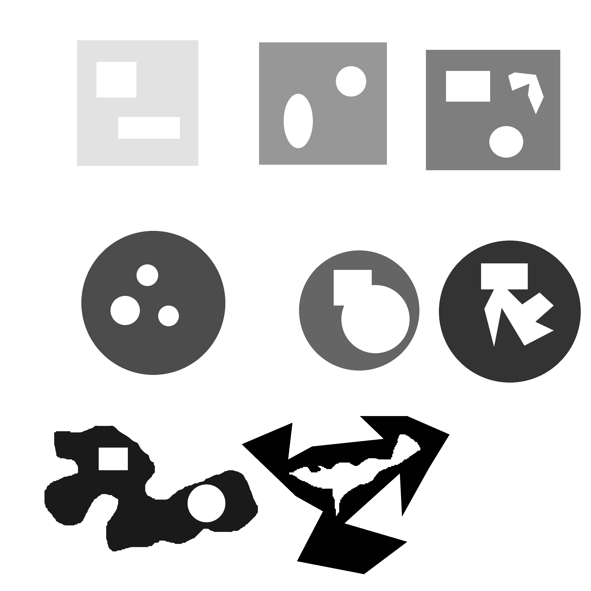
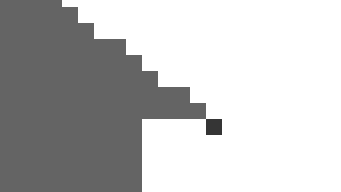
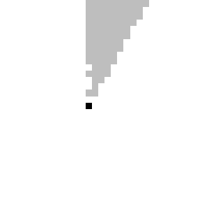

# Identificação e Contagem de Formas

Este repositório é referente ao projeto final da matéria: Processamento de imagem.

O programa é capaz de ler arquivos bitmap, .pbm, procurar e contar o número de formas e buracos,
presentes na imagem.

Presentemente não existem restrições para os tipos de formas e buracos que o programa é capaz de detectar.
Obs.: Ler no final do readme.md a definição de formas e buracos para esse projeto.

## Entrada/Input

Após ser compilado o programa recebe apenas um argumento de entrada:
o endereço da imagem .pbm que deve ser analisada
```bash
diego@diego-Notebook:~/Documents/UFS/2021.2/Processamento de Imagem/PI---Encontrar-Formas/Test_Folder$ ./teste.out test_imgs/SoulsLike.pbm
```
## Saída/Output

Esse programa gera 4 formas diferente de saídas:

#### 1º STD_OUT
No std_out é gerado um log no seguinte formato:

```bash
LOAD
X: 3000 -- Y: 3000
line size = 94
total img size = 282188 integers
Load demorou: 0.113480 segundos
-------------------------------------------
Formas
Total de formas Encontradas: 8
Busca por formas/gerar graymap demorou: 1.569558 segundos
-------------------------------------------
Buracos
Total de buracos Encontrados: 15
Busca por buracos/gerar graymap demorou: 1.922716 segundos
-------------------------------------------
Formas com Defeitos
Total de peças com defeito: 8
Busca por peças com defeito demororu: 0.107182 segundos
-------------------------------------------
SAVE
Save demorou: 0.138473 segundos

```
Nele é possível ver 5 seções, a primeira dá informações sobre a imagem original,
a segunda mostra o total de formas encontradas, a terceira mostra o total de buracos,
a quarta mostra o número de peças com buracos (peças com defeito),
e a última mostra que a cópia da imagem foi feita com sucesso.

Cada uma das 4 portes também contem o tempo gasto para executar
cada uma das respectivas partes do código.

#### 2º Arquivo Cópia.pbm

Cópia.pbm é como o nome indica uma cópia da imagem original, ele é gerado
apenas pra demonstrar a capacidade de gravar arquivos no formato .pbm.

#### 3º e 4º Arquivos: "FormasGraymap.pgm" e "BuracosGraymap.pgm"

Esses arquivos .pgm são graymaps que contem em seus cometários
os números de formas e buracos encontrados nas imagens, além de mostrarem cada
forma ou buraco em um tom de cinza diferente para facilitar a compreensão por parte do
usuário.



## Observações e Esclarecimentos

- #### Definição de Forma e Buraco

É fundamental para esse projeto saber a definição do que é uma forma ou um buraco,

Esse programa considera como forma, qualquer conjunto de pixeis de valor 1, 4-conectados,
pixeis 4-conectados. A wikipedia possui uma explicação bem simples da conectividade de pixeis,
que pode ser lida em: https://pt.wikipedia.org/wiki/Conectividade_de_pixels .

A definição de Buraco é semelhante a definição de Forma, entretanto ela leva em consideração
os pixeis de valor 0.

- ####   Otimização no armazenamento da imagem em memória principal

Uma boa prática de programação é não desperdiçar espaço em memória principal,
caso o bitmap fosse armazenado como um array de inteiros (solução mais simples) cada bit
da imagem ocuparia o espaço de um inteiro (4 bytes) o que seria um enorme desperdício de memória,
o ideal seria utilizar um array de bits, entretanto isso não é suportado diretamente em C, todavia C
é uma linguagem totalmente capaz de realizar operações bitwise e elas são extremamente rápidas,
dessa forma o que foi feito nesse projeto foi agrupar um conjunto de 32 pixeis e salvá-los em um (unsigned int)
de forma que cada bit do inteiro representa um pixel da imagem, dessa forma nós economizamos 96.875% de memória.
uma explicação mais detalhada contendo exemplos em código pode ser encontrada em: http://www.mathcs.emory.edu/~cheung/Courses/255/Syllabus/1-C-intro/bit-array.html .

- #### Atenção e Caso especial

Caso especial: Como dito anteriormente esse programa considera que forma e buracos são elementos 4-conectados,
dessa forma pixeis que se "conectam" com a imagem apenas pelas diagonais, são reconhecidos como formas independentes,
o código poderia ser modificado para acomodar elementos 8-conectados, entretanto não optamos por essa configuração
pois em nosso entendimento formas grandes que se conectam apenas por uma diagonal são duas formas distintas, e se considerarmos
elementos 8-conectados tais formas seriam unidas pelo algoritmo.




Atenção: A menor forma possivel e o menor buraco possivel são um único pixel 0 ou 1 rodeado por elementos do valor oposto,
como, por exemplo, um pixel preto rodeado por pixeis brancos. é importante lembrar disso pois ao gerar as imagens de testes com formas que contem
diversas curvas, pontas ou formatos complexos, alguns softwares de imagem como o GIMP, pode acabar gerando pixeis "flutuantes" perto das pontas dessa curvas,
muitas vezes decorrente de funções como anti aliasing, e ferramentas como "Free select Tool".


